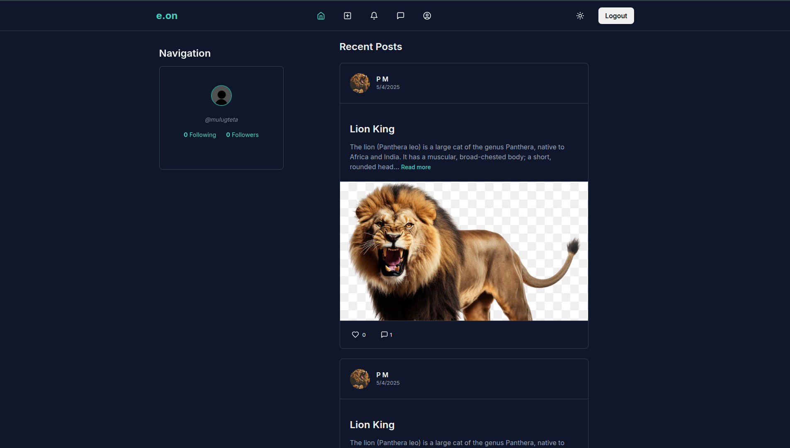

# Social Media Web App



A full-featured **social media application** developed using **Flask** for the backend and **React** for the frontend. This project allows users to interact via posts, comments, and messages — aiming to create a modern, responsive, and real-time social platform.

## 🔧 Tech Stack

### Frontend
- **React.js**
- React Router
- Context API
- Axios
- custom CSS

### Backend
- **Python Flask**
- Flask SQLAlchemy
- Marshmallow
- JWT Authentication
- Flask CORS

### Database
- SQLite (development)
- PostgreSQL or MySQL (optional for production)

## 📁 Project Structure

```
social-media-app-flask/
├── frontend/               # React frontend
│   └── src/
│       ├── components/     # Reusable UI components
│       ├── context/        # Global state management
│       ├── features/       # Business logic modules
│       ├── hooks/          # Custom React hooks
│       ├── layout/         # Page layout structure
│       ├── pages/          # React pages
│       ├── services/       # API calls
│       ├── styles/         # CSS or Tailwind styling
│       └── utils/          # Utility functions
│   └── public/projectImage/homepage.png  # Homepage screenshot
├── social_media_backend/   # Flask backend
│   ├── app/                # Core app code
│   ├── instance/           # App instance configuration
│   ├── migrations/         # DB migrations
│   ├── tests/              # Backend tests
│   ├── run.py              # Entry point
│   └── requirements.txt    # Python dependencies
└── README.md               # Project overview
```

## 🚀 Setup Instructions

### Backend (Flask)

1. **Create virtual environment**
   ```bash
   python3 -m venv .venv
   source .venv/bin/activate
   ```

2. **Install dependencies**
   ```bash
   pip install -r requirements.txt
   ```

3. **Run backend**
   ```bash
   python run.py
   ```

### Frontend (React)

1. **Navigate to frontend**
   ```bash
   cd frontend
   ```

2. **Install dependencies**
   ```bash
   npm install
   ```

3. **Run frontend**
   ```bash
   npm run dev
   ```

> ⚠️ Ensure the backend API URL is correctly configured in your frontend code (usually in `services/` or `utils/` folder).

---

## 🖼️ Homepage Preview


---

## 🧠 Features in Development

- User authentication
- Real-time chat
- Profile customization
- Post likes and comments
- Notifications

---

## 📄 License

This project is licensed under the MIT License.

---

## 🙋‍♂️ Author

**Eyob Mulugeta**  
Email: [eyobbmulugeta@gmail.com](mailto:eyobbmulugeta@gmail.com)  
Telegram: [@Ecode_env](https://t.me/Ecode_env)
